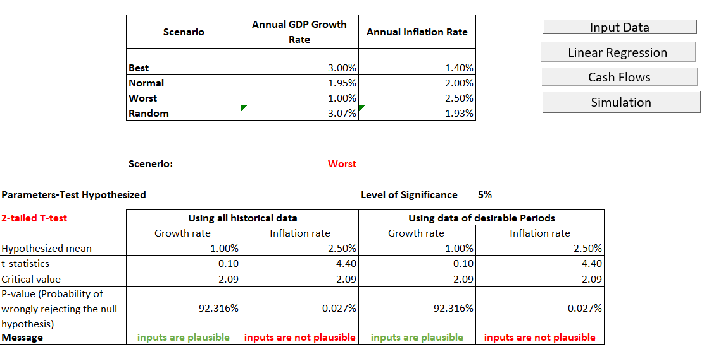
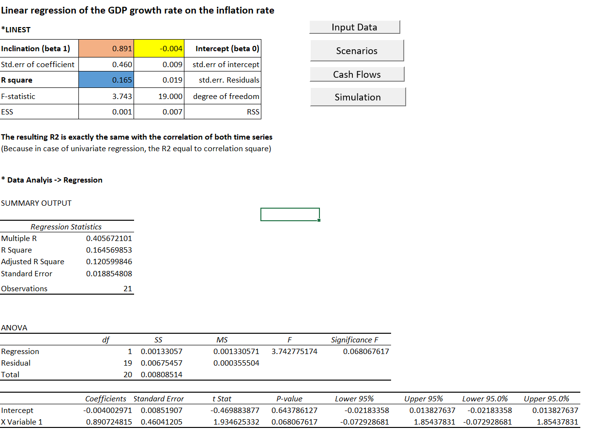
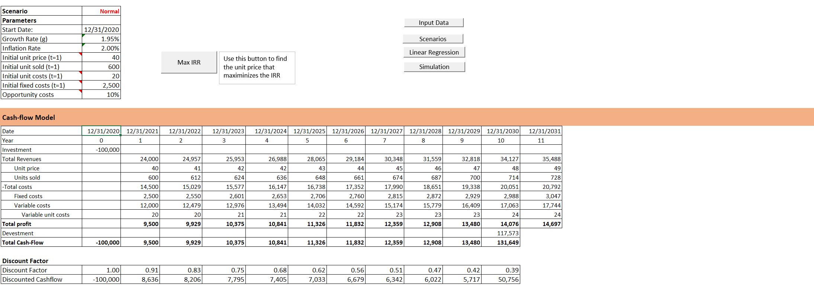
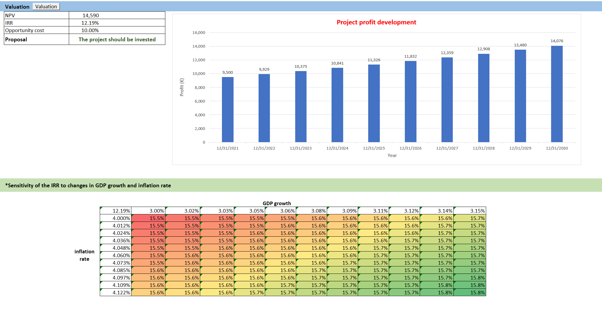
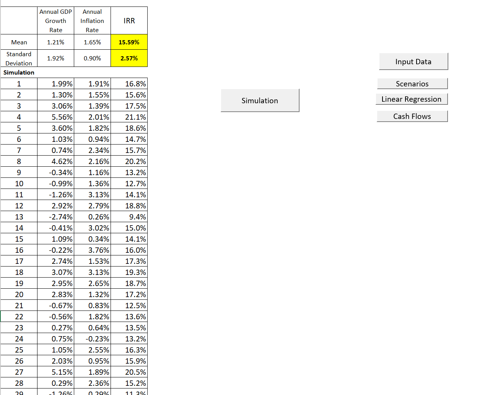

# Financial Modeling with Microsoft Excel

## Purpose:
This project is designed to develop and solidify financial modeling concepts using Microsoft Excel. It offers a step-by-step guide to constructing an integrated financial model, aligned with a company’s investment planning process.

## Overview:
The Excel-based tools developed in this project will guide users through the process of planning and analyzing a company investment, covering key financial metrics and statistical methods. The model includes the following key components:
 1. **Historical Data Analysis:**
- Estimate the statistical parameters for the annual GDP growth rate and annual inflation rate from 2000 to 2021. This involves using Q4 and December values (starting from 12/1999 to calculate the first inflation rate).
- Enable users to select and filter specific years, displaying the corresponding statistical parameters for comparison against total data.
2. **Scenario Analysis:**
- Allow direct user input for annual sales growth and inflation rates across three different scenarios.
- Perform a two-sided t-test at a 5% significance level to assess the plausibility of these inputs based on historical data (2000 to 2020).
3. **Linear Regression Analysis:**
- Conduct a linear regression of the GDP growth rate against the inflation rate, using data from 2000 to 2020.
- Display the intercept, slope, and compare the R² value from the regression with the correlation of the time series.
4. **Cash Flow Modeling:**
 - Build a ten-year cash flow model based on the assumed rates and scenarios.
 - Create a chart depicting the total profit development.
 - Calculate the total cash flow using the Internal Rate of Return (IRR) and compare it to the given opportunity costs.
- Conduct sensitivity analysis of the IRR to changes in growth and inflation rates.
- Optimize the unit price to maximize the IRR using Solver and a VBA subroutine triggered by a button.
5. **Simulation:**
 - Implement a Monte Carlo simulation using VBA to model GDP growth and inflation rates based on normal distribution and mutual independence.
 - Collect and evaluate the resulting IRR from each simulation run, analyzing the mean and standard deviation.

## Data and Assumptions:
All necessary data and assumptions are provided across three sheets:
- Basics: Contains foundational data for the model.
- Data_Growth: Historical data on GDP growth.
- Data_Inflation: Historical data on inflation rates.

## Workflow:
 1.  **Input Data**: Summarizes the statistical properties of the growth and inflation rates from historical data. This serves as a benchmark for selecting appropriate growth and inflation rates.
2.   **Scenarios**: Facilitates user input of sales growth and inflation rates across three scenarios and tests their statistical validity.

Figure 1

4.  **Linear Regression**: Analyzes the relationship between GDP growth and inflation through linear regression.

Figure 2

6.  **Cash Flow**: Develops a cash flow model, evaluates IRR, and assesses its sensitivity to rate changes.

Figure 3

Figure 4

8.  **Simulation**: Runs a Monte Carlo simulation to model potential outcomes and assess the IRR's variability.

Figure 5

## Key Learning Outcomes:
 - Identify growth drivers from historical data using Excel.
 - Apply discounted cash flow (DCF) analysis for investment evaluation.
 - Implement Monte Carlo simulations to derive key financial assumptions.
 - Develop detailed asset and debt schedule models in Excel.
 - Leverage advanced features of Excel for financial analysis.
 - Calculate profitability ratios using various profit metrics.

My solution details are given in the [attached Excel sheet](https://github.com/vutrang1808/excel_financial_modeling/blob/main/Project_Vu.xlsm). 
